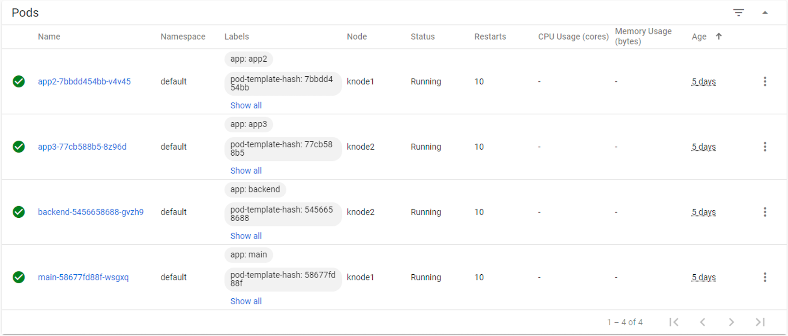
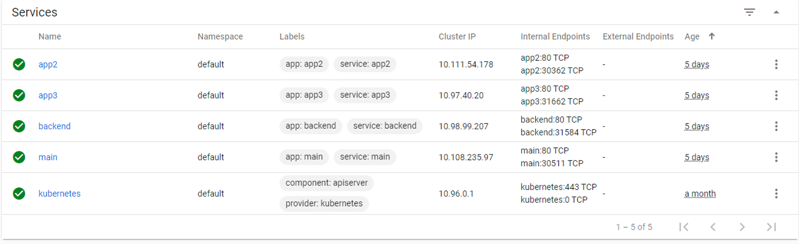

Step 1 - Deploy and publish Arcadia Finance application in Kubernetes
#####################################################################

It's time to deploy Arcadia Finance application :)

**Deploy Arcadia Application with kubectl command**

With Kubernetes, there are several ways to deploy containers (pods). One way is tu use ``kubectl`` command with a YAML deployment file.
I prepared this YAML file below (this is only for mainr app container). You can have a look, and see it will deploy containers from my Gitlab.com repo.

.. code-block:: YAML

    apiVersion: v1
    kind: Service
    metadata:
    name: main
    namespace: default
    labels:
        app: main
    spec:
    type: NodePort
    ports:
    - name: main-80
        nodePort: 30511
        port: 80
        protocol: TCP
        targetPort: 80
    selector:
        app: main
    ---
    apiVersion: apps/v1
    kind: Deployment
    metadata:
    name: main
    namespace: default
    labels:
        app: main
        version: v1
    spec:
    replicas: 1
    selector:
        matchLabels:
        app: main
        version: v1
    template:
        metadata:
        labels:
            app: main
            version: v1
        spec:
        containers:
        - env:
            - name: service_name
            value: main
            image: registry.gitlab.com/arcadia-application/main-app/mainapp:latest
            imagePullPolicy: IfNotPresent
            name: main
            ports:
            - containerPort: 80
            protocol: TCP
    ---

.. note:: To make it simple, it deploys the container from gitlab.com repo, and a service. The service is used later on by the NGINX Plus Ingress Controller.

**Steps :**

    #. SSH (not WebSSH) to CICD Server
    #. Run this command ``kubectl apply -f /home/ubuntu/Arcadia_k8S/all_apps.yaml``

    #. RDP to the jumhost with ``user:user`` as credentials
    #. Open Chrome
    #. Open Kubernetes Dahsboard bookmark (if not already opened)
    #. Click ``skip`` on the logon page
    #. You should see the services and the pods

.. warning:: Arcadia Application is running but not yet available for the customers. We need to publish it.