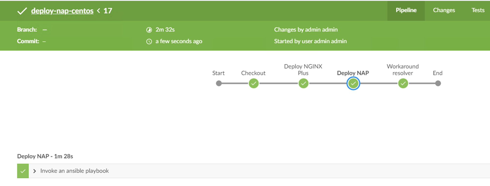

Step 10 - Deploy App Protect via CI/CD pipeline
##############################################

In this module, we will install NGINX Plus and App Protect packages on CentOS with a CI/CD toolchain. NGINX teams created Ansible modules to deploy it easily in a few seconds.

.. note:: The official Ansible NAP role is available here https://github.com/nginxinc/ansible-role-nginx-app-protect and the NGINX Plus role here https://github.com/nginxinc/ansible-role-nginx 

**Uninstall the previous running NAP**

    #. SSH to the App Protect in CentOS VM

    #. Uninstall NAP in order to start from scratch

        .. code-block:: bash

            sudo yum remove -y app-protect*

        .. image:: ../pictures/module2/yum-remove-app-protect.png
           :align: center
           :scale: 50%

    #. Uninstall NGINX Plus packages

        .. code-block:: bash

            sudo yum remove -y nginx-plus*

        .. image:: ../pictures/module2/yum-remove-nginx-plus.png
           :align: center
           :scale: 70%

    #. Delete/rename the directories from the existing deployment

        .. code-block:: bash

            sudo rm -rf /etc/nginx
            sudo rm -rf /var/log/nginx

**Run the CI/CD pipeline from Jenkins**

Steps:

    #. RDP to the Jumphost with credentials ``user:user``

    #. Open ``Chrome`` and open ``Jenkins`` (if not already opened)

    #. Select the pipeline ``deploy-nap-centos`` and run it

    .. image:: ../pictures/module2/pipeline.png
       :align: center
       :scale: 50%

The pipeline is as below:

.. code-block:: groovy

    node {
    stage 'Checkout'
         // // Get some code from a GitHub repository
        git url: 'http://10.1.20.4/nginx-app-protect/ansible_deploy.git'
        sh 'ansible-galaxy install -r requirements.yml --force'
   
    stage name: 'Deploy NGINX Plus', concurrency: 1
            dir("${env.WORKSPACE}"){
            ansiblePlaybook inventory: 'hosts', playbook: 'install-nginx-plus.yml'
            }

    stage name: 'Deploy NAP', concurrency: 1
            dir("${env.WORKSPACE}"){
            ansiblePlaybook inventory: 'hosts', playbook: 'app-protect.yml'
            }
            
    stage name: 'Workaround resolver', concurrency: 1
            dir("${env.WORKSPACE}"){
            ansiblePlaybook inventory: 'hosts', playbook: 'copy-nginx-conf.yml'
            }
    }

.. note:: As you can notice, the ``Checkout`` stage installs the ``requirements``. We use the parameter ``--force`` in order to be sure we download and install the latest version of the module.

.. note:: This pipeline executes 3 Ansible playbooks. 
    
    #. One playbook to install NGINX Plus
    #. One playbook to install NAP
    #. The last playbook is just there to fix an issue in UDF for the DNS resolver

When the pipeline is finished executing, perform a browser test within ``Chrome`` using the ``Arcadia NAP Docker`` bookmark

.. note :: Congrats, you deployed ``NGINX Plus`` and ``NAP`` with a CI/CD pipeline. You can check the pipelines in ``GitLab`` if you are interested to see what has been coded behind the scenes. But it is straight forward as the Ansible modules are provided by F5/NGINX.

**Video of this module (force HD 1080p in the video settings)**

.. raw:: html

    

    <iframe width="1120" height="630" src="https://www.youtube.com/embed/1SyqUrubSr0" frameborder="0" allow="accelerometer; autoplay; encrypted-media; gyroscope; picture-in-picture" allowfullscreen></iframe>
    

