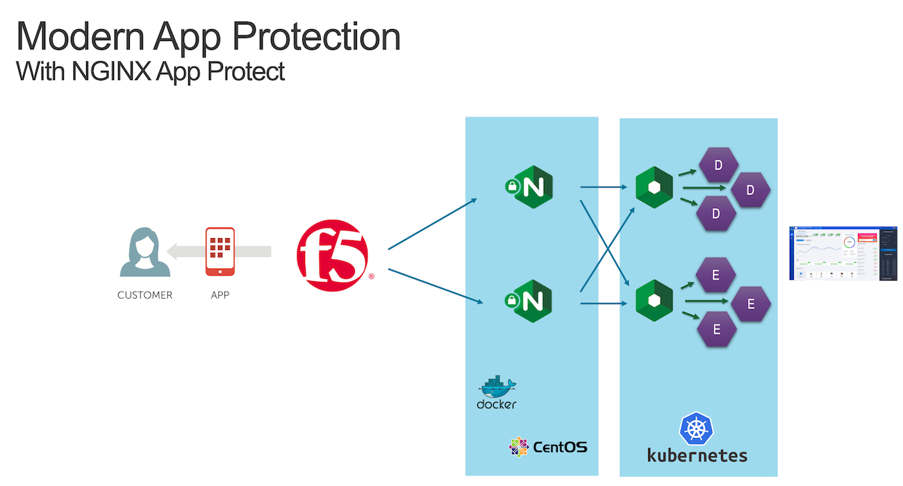
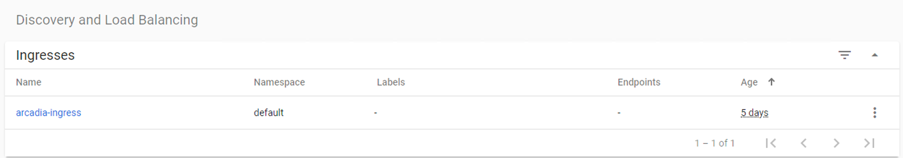

Step 11 - Deploy a new version of the NGINX Plus Ingress Controller
###################################################################

As a reminder, in ``Class 1 - Step 2 - Publish Arcadia App with a NGINX Plus Ingress Controller`` we deployed a NGINX Plus instance as an Ingress Controller in our Kubernetes cluster.

Now, with NAP v1.3, we can deploy this NGINX Plus instance with the NAP module enabled. 

To do so, we will:

#. Deploy a new version of the Pod (NGINX r22 + NAP v1.3)
#. Deploy a new Ingress configuration template (with NAP configuration files)

.. warning:: The NGINX Plus Ingress Controller image is available on my private Gitlab repo. Don't share the key.

**Steps**

    #. SSH (or WebSSH and ``cd /home/ubuntu/``) to CICD Server
    #. Run this command in order to delete the previous KIC ``kubectl delete -f /home/ubuntu/k8s_ingress/full_ingress_arcadia.yaml``
    #. Run this command in order to push the new version of the KIC ``kubectl apply -f /home/ubuntu/k8s_ingress/full_ingress_arcadia_nap.yaml``
    #. Check the Ingress ``arcadia-ingress`` (in the ``default`` namespace) by clicking on the 3 dots on the right and ``edit``
    #. Scroll down and check the specs

As you can notice, we added few lines in our Ingress declaration. To do so, I followed the guide (https://docs.nginx.com/nginx-ingress-controller/app-protect/installation/)

    #. I added NAP specifications (from the guide)
    #. I added NAP annotations for Arcadia app (see below)

.. code-block:: YAML

    ---
    apiVersion: extensions/v1beta1
    kind: Ingress
    metadata:
    name: arcadia-ingress
    annotations:
        appprotect.f5.com/app-protect-policy: "default/dataguard-blocking"
        appprotect.f5.com/app-protect-enable: "True"
        appprotect.f5.com/app-protect-security-log-enable: "True"
        appprotect.f5.com/app-protect-security-log: "default/logconf"
        appprotect.f5.com/app-protect-security-log-destination: "syslog:server=10.1.20.6:5144"

    spec:
    rules:
    - host: k8s.arcadia-finance.io
        http:
        paths:
        - path: /
            backend:
            serviceName: main
            servicePort: 80
        - path: /files
            backend:
            serviceName: backend
            servicePort: 80
        - path: /api
            backend:
            serviceName: app2
            servicePort: 80
        - path: /app3
            backend:
            serviceName: app3
            servicePort: 80

Please a make a new test by clicking on ``Arcadia k8s`` Chrome bookmark.

    #. Open ``Chrome``
    #. Click on ``Arcadia k8s`` bookmark
    #. Now, you are connecting to Arcadia App from a new KIC with NAP enabled
    #. Send an attack (like a XSS in the address bar) by appending ``?a=<script>``
    #. Attack is blocked
    #. Open ELK and check your logs

